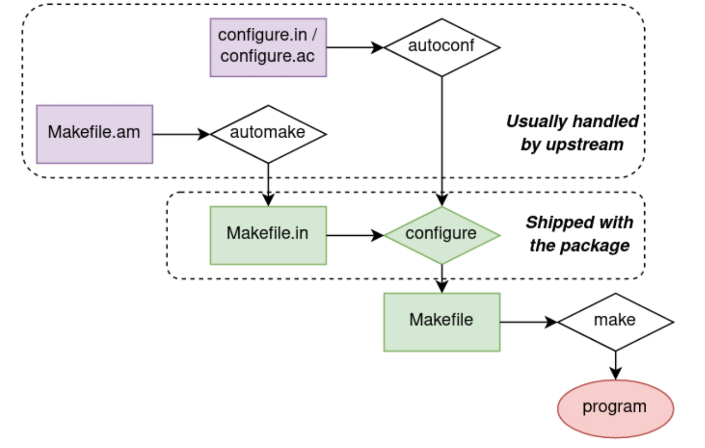

# Autotools

Autotools 是包含 AutoConf、AutoMake、Libtool 等工具的集合



```bash
# -v 或 --verbose：增加输出的详细程度。这意味着 autoreconf 将输出更多的信息，这些信息可以帮助理解正在执行的操作以及可能出现的问题
# -f 或 --force：强制重新生成配置脚本和数据文件，即使它们已经存在。这是一种保证最新配置被应用的方法，避免因旧文件导致的潜在问题
# -i 或 --install：同时会调用 aclocal 和 automake 时带上 --add-missing 选项，这个选项会自动复制一些缺少的标准文件（例如 install-sh、missing、depcomp 等）到你的源代码目录下，这是确保你的包可以正确构建的一个重要步骤
autoreconf -vfi

mkdir build; cd build

../configure

# 设置并发为 4
make -j4

./helloworld
```